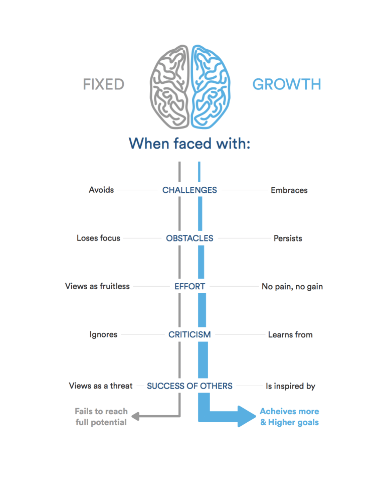

<!-- This is a website about myself with links to my notes on reading assignments for Code 201 at Codefellows. -->

# Code 201 Reading Notes 
## Hello!
- My name is Haustin Kimbrough. I currently reside in Vail, Arizona with my wife and newbown daughter, **Winter Sofia**. I am originally from Tennessee, but being an Army brat and, eventually, a soldier myself, I found my way to Arizona.  I am currently an educator of Human Intelligence Collectors at Fort Huachuca, AZ, but will soon be leaving my position to pursue the **Code Fellows** program fully.
- I love video games and all things nastalgia. The ~~80's~~ 90s was the best! [Runescape](https://www.runescape.com/community), Pokemon, and *Dragonball Z* often come to mind!

- Please check out my GitHub [profile](https://github.com/hkimbrough22/)!

## Growth Mindset

### What is it?
- A growth mindset is a love of learning. It is constantly looking for ways to improve through challenges, criticism, or failure.

### Growth Mindset Reminders
1. A growth mindset believes that one’s fundamental abilities can be developed through perseverance and effort; intelligence and talent are simply good starting points.
2. A growth mindset is synonymous with a love of learning.
3. A growth mindset embraces challenges and learns from criticism.
4. Never be afraid to dive in, [Google](https://www.google.com) something, and try it out.

## Code 201 - Table of Contents
1. [Introduction to HTML and Javascript](code201/class-01.md)
2. [Basics of HTML, CSS, and JS](code201/class-02.md)
3. [HTML Lists, Control Flow with JS, and the CSS Box Model](code201/class-03.md)
4. [HTML Links, JS Functions, and Intro to CSS Layout](code201/class-04.md)
5. [Images, Color, Text](code201/class-05.md)
6. [Problem Domain, Objects, and the DOM](code201/class-06.md)
7. [Object-Oriented Programming and HTML Tables](code201/class-07.md)
8. [CSS Layout](code201/class-08.md)
9. [Forms and JS Events](code201/class-09.md)
10. [Debugging](code201/class-10.md)
11. [Audio, Video, and Images](code201/class-11.md)
12. [Chart.js and Canvas](code201/class-12.md)
13. [Local Storage](code201/class-13.md)
14. [Class 14](code201/class-14.md)
15. [Class 15](code201/class-15.md)

## Code 102 Reading Notes

### Code 102 - Table of Contents
1. [Markdown Lessons Learned](code102/markdown.md)
2. [Text Editor Summary and Terminal Cheat Sheet](code102/text-editor.md)
3. [Git Introduction](code102/git-introduction.md)
4. [HTML Introduction](code102/html-introduction.md)
5. [CSS Introduction](code102/css-introduction.md)
6. [Javascript Introduction](code102/javascript-introduction.md)
7. [Javascript Continued](code102/javascript-cont.md)
8. [Javascript Loops](code102/javascript-loops.md)