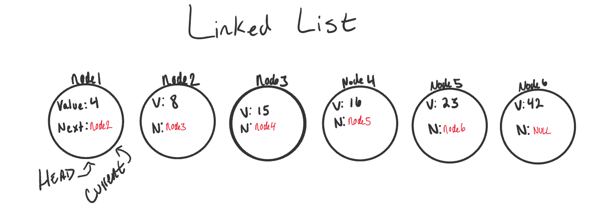

# Code 401 - Reading Notes

<!-- All references used were from Code 401 reading
assignment 05-->
## Linked List
[comment]: <> (https://codefellows.github.io/common_curriculum/data_structures_and_algorithms/Code_401/class-05/resources/singly_linked_list.html)

[comment]: <> (https://medium.com/basecs/whats-a-linked-list-anyway-part-1-d8b7e6508b9d)

[comment]: <> (https://medium.com/basecs/whats-a-linked-list-anyway-part-2-131d96f71996)

- LL is a sequence of Nodes that are connected/linked to each other.
- Singly and Doubly - refers to number of references the node has.
- Singly has one reference - next
- Doubly has two - next and previous
- Nodes are the individual pieces of data in the list
- Each Node contains a property called NExt (references next Node in sequence)
- Head refers to first Node
- Current refers to current Node being looked at.
- Create a Current at the Head to ensure you start from beginning.

 

[BACK TO HOME](../README.md)
