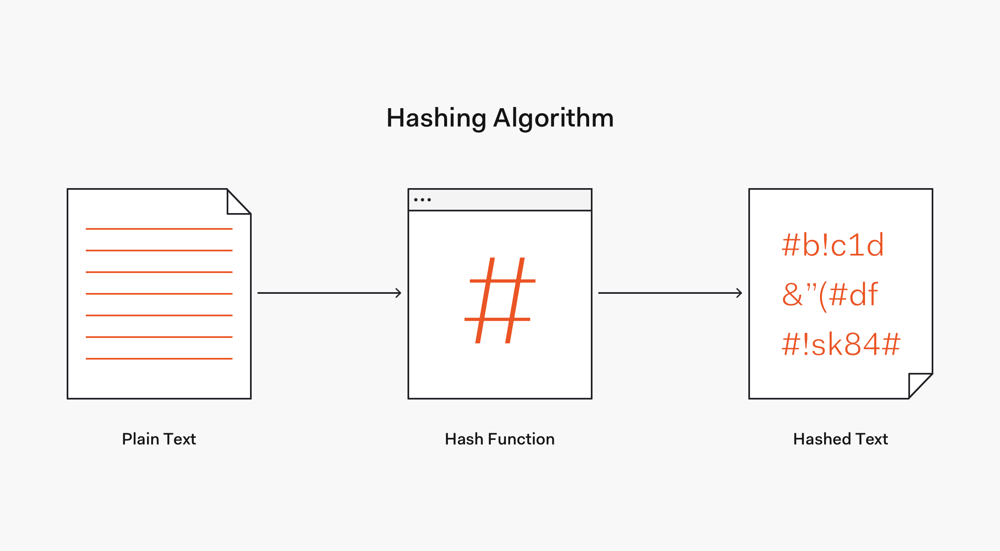

# Code 401 - Reading Notes
<!-- All references used were from Code 401 reading
assignment 14 -->
[comment]: <> (https://auth0.com/blog/hashing-passwords-one-way-road-to-security/)
[comment]: <> (https://danboterhoven.medium.com/why-you-should-use-bcrypt-to-hash-passwords-af330100b861)
[comment]: <> (https://www.mindrot.org/projects/jBCrypt/)
## Hashing
A more secure way to store a password is to transform it into data that cannot be converted back to the original password. This mechanism is known as hashing.

Thus, in contrast to encryption, hashing is a one-way mechanism. The data that is hashed cannot be practically "unhashed".

-Irreversible

## BCrypt
- Based on the Blowfish block cipher crypto-matic algorithm and takes the form of an adaptive hash function
- Using a Key Factor, BCrypt is able to adjust the cost of hashing. With Key Factor changes, the hash output can be influenced. In this way, BCrypt remains extremely resistant to hacks, especially a type of password cracking called rainbow table.

[BACK TO HOME](../README.md)